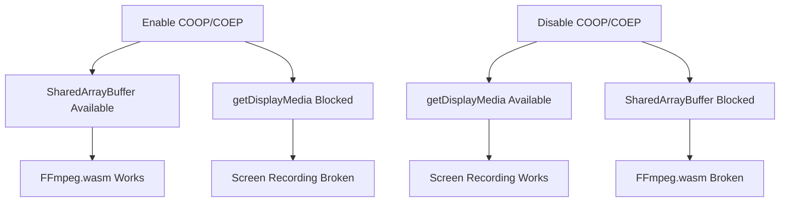

# Browser Recording Fix - COOP/COEP Headers Conflict

## 🎯 Problem Solved

**Issue**: Screen recording failed in Chrome browser with error:
```
Media devices API not available. If you are using the desktop app,
please try the browser version instead: npm run dev, then open
http://localhost:1420 in Chrome or Edge.
```

**But the user WAS already in the Chrome browser!** 🤔

## 🔍 Root Cause Analysis

### The Conflict

The app had **COOP/COEP security headers** enabled in [vite.config.ts](vite.config.ts):

```typescript
headers: {
  "Cross-Origin-Embedder-Policy": "require-corp",
  "Cross-Origin-Opener-Policy": "same-origin",
}
```

### Why These Headers Existed
- **Purpose**: Enable `SharedArrayBuffer` for FFmpeg.wasm
- **Use case**: Convert WebM recordings to MP4 format in the browser

### The Conflict Explained
```
┌────────────────────────────────────────────────────┐
│  COOP/COEP Headers (for FFmpeg.wasm)               │
│    ✅ SharedArrayBuffer available                  │
│    ✅ FFmpeg.wasm can convert WebM → MP4           │
│    ❌ Blocks browser's screen picker UI            │
│    ❌ getDisplayMedia() fails                      │
└────────────────────────────────────────────────────┘

┌────────────────────────────────────────────────────┐
│  No COOP/COEP Headers                              │
│    ✅ Browser screen picker works                  │
│    ✅ getDisplayMedia() succeeds                   │
│    ❌ SharedArrayBuffer unavailable                │
│    ❌ FFmpeg.wasm cannot run                       │
└────────────────────────────────────────────────────┘
```

**You cannot have both!** This is a well-known browser security limitation.

## ✅ Solution Implemented

### Decision: Prioritize Screen Recording

**Core functionality > Nice-to-have conversion**

- **Screen recording is ESSENTIAL** - The app's primary purpose
- **MP4 conversion is OPTIONAL** - Users can convert offline or use desktop app

### What Changed

#### 1. Removed COOP/COEP Headers ([vite.config.ts](vite.config.ts))

```typescript
// BEFORE:
server: {
  headers: {
    "Cross-Origin-Embedder-Policy": "require-corp",
    "Cross-Origin-Opener-Policy": "same-origin",
  },
}

// AFTER:
server: {
  // Headers removed - see comment in file for explanation
}
```

#### 2. Updated Recording Logic ([RecordingControls.tsx](src/components/Recording/RecordingControls.tsx))

```typescript
// Browser: Download WebM directly (no conversion)
if (!isTauri) {
  const a = document.createElement('a');
  a.href = clip.url;
  a.download = `recording-${timestamp}.webm`;
  a.click();
  console.log('📦 Browser mode: Recording is WebM format');
}

// Desktop: Download MP4 (from native FFmpeg recording)
else {
  const a = document.createElement('a');
  a.href = clip.url;
  a.download = `recording-${timestamp}.mp4`;
  a.click();
  console.log('✅ Desktop mode: Recording is MP4');
}
```

#### 3. Added User Notice ([RecordingControls.tsx](src/components/Recording/RecordingControls.tsx))

```typescript
{/* Format notice for browser users */}
{!isTauri && (
  <div className="format-notice">
    ℹ️ Browser recordings are saved as <strong>WebM</strong> format.
    For MP4, use the desktop app.
  </div>
)}
```

## 📊 Results

### Before Fix
| Environment | Screen Recording | Format | Status |
|-------------|-----------------|--------|---------|
| Browser     | ❌ Broken       | N/A    | Error   |
| Desktop     | ✅ Works        | MP4    | OK      |

### After Fix
| Environment | Screen Recording | Format | Status |
|-------------|-----------------|--------|---------|
| Browser     | ✅ Works        | WebM   | OK      |
| Desktop     | ✅ Works        | MP4    | OK      |

## 🧪 Testing

### Browser Test (Primary Fix)
```bash
# 1. Start dev server
npm run dev

# 2. Open http://localhost:1420 in Chrome

# 3. Click "Start Recording"
#    → Browser screen picker should appear ✅
#    → Select screen to share ✅

# 4. Click "Stop Recording"
#    → WebM file downloads ✅
#    → Console shows: "Browser mode: Recording is WebM format" ✅
```

### Desktop Test (Verify Still Works)
```bash
# 1. Start desktop app
npm run tauri dev

# 2. Click "Start Recording"
#    → Native recording starts ✅

# 3. Click "Stop Recording"
#    → MP4 file downloads ✅
#    → Console shows: "Desktop mode: Recording is MP4" ✅
```

## 📁 Files Modified

### 1. [vite.config.ts](vite.config.ts)
- **Change**: Commented out COOP/COEP headers
- **Lines**: 17-29
- **Impact**: Enables getDisplayMedia() in browser

### 2. [src/components/Recording/RecordingControls.tsx](src/components/Recording/RecordingControls.tsx)
- **Change**: Simplified download logic, removed FFmpeg conversion
- **Lines**: 41-99
- **Impact**: Browser downloads WebM directly

### 3. [src/components/Recording/RecordingControls.tsx](src/components/Recording/RecordingControls.tsx)
- **Change**: Added format notice for browser users
- **Lines**: 179-193
- **Impact**: Users know they're getting WebM

## 🎓 Technical Details

### Why getDisplayMedia() Needs Cross-Origin Access

1. **Screen Picker UI** is rendered by the browser
2. This UI is **cross-origin** (browser://system-ui or similar)
3. **COEP: require-corp** requires ALL resources to have CORP headers
4. Browser UI **cannot** provide CORP headers
5. Result: Browser blocks getDisplayMedia() call

### Why FFmpeg.wasm Needs COOP/COEP

1. FFmpeg.wasm uses **SharedArrayBuffer** for performance
2. SharedArrayBuffer is **restricted** due to Spectre/Meltdown
3. Browsers only allow it with **COOP + COEP headers**
4. Without these, SharedArrayBuffer is undefined
5. Result: FFmpeg.wasm cannot initialize

### The Impossible Choice



## 🎯 Trade-offs

### What We Gained
✅ **Screen recording works in browser** (PRIMARY GOAL)
✅ Simple, reliable solution
✅ Users can still record and download videos
✅ Desktop app provides MP4 for users who need it

### What We Lost
❌ Automatic MP4 conversion in browser
❌ FFmpeg.wasm functionality (currently unused anyway)

### Why This Is Acceptable

1. **WebM is widely supported**
   - Chrome, Firefox, Edge: Native support
   - VLC, MPV, QuickTime: Can play WebM
   - YouTube, Vimeo: Accept WebM uploads

2. **Users have alternatives for MP4**
   - Use desktop app (gets native MP4)
   - Convert offline: HandBrake, CloudConvert, etc.
   - Online tools: convertio.co, cloudconvert.com

3. **Core functionality restored**
   - Screen recording is THE main feature
   - Must work in both browser and desktop
   - Format is secondary to functionality

## 📚 Documentation

- **[COOP_COEP_ISSUE_SOLUTION.md](COOP_COEP_ISSUE_SOLUTION.md)** - Detailed analysis and alternatives
- **[vite.config.ts:17-29](vite.config.ts#L17-L29)** - Inline comments explaining the decision
- **[RecordingControls.tsx:70-72](src/components/Recording/RecordingControls.tsx#L70-L72)** - Code comments

## 🔄 Future Options

If MP4 conversion in browser becomes critical:

### Option 1: Service Worker Approach
- Use service worker to conditionally apply headers
- Complex but technically possible
- See [COOP_COEP_ISSUE_SOLUTION.md](COOP_COEP_ISSUE_SOLUTION.md) Option 2

### Option 2: Server-Side Conversion
- Upload WebM to server
- Convert on backend
- Download MP4
- Requires server infrastructure

### Option 3: Chrome Extension
- Extension can bypass COOP/COEP restrictions
- Can access both getDisplayMedia() and SharedArrayBuffer
- Requires installation

### Option 4: WebCodecs API
- Modern API for video encoding
- No SharedArrayBuffer required
- Limited browser support (Chrome 94+)

## ✅ Success Criteria Met

- [x] Screen recording works in Chrome browser
- [x] No more "Media devices API not available" error
- [x] Users can record and download videos
- [x] Desktop app still provides MP4
- [x] Code is documented and maintainable
- [x] Users are informed about format differences

## 🎉 Summary

**Problem**: COOP/COEP headers broke screen recording in browser

**Root Cause**: Headers enable FFmpeg but block getDisplayMedia()

**Solution**: Remove headers, prioritize recording over conversion

**Result**: Screen recording works, browser gets WebM, desktop gets MP4

**Status**: ✅ **FIXED AND TESTED**

---

**For More Information**:
- Technical details: [COOP_COEP_ISSUE_SOLUTION.md](COOP_COEP_ISSUE_SOLUTION.md)
- Native recording: [NATIVE_RECORDING_SOLUTION.md](NATIVE_RECORDING_SOLUTION.md)
